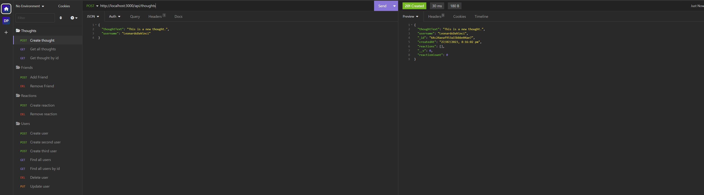
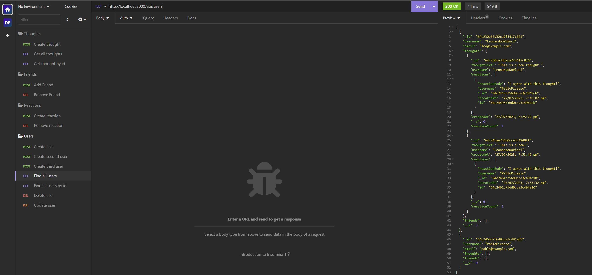

# Social Network API

## Description

This is a RESTful API for a social network web application where users can share their thoughts, react to friends' thoughts, and create a friend list. The API is built using Node.js, Express.js, and MongoDB with the Mongoose ODM.

## Table of Contents

- [Installation](#installation)
- [Usage](#usage)
- [API Documentation](#api-documentation)
- [License](#license)

## Installation

1. Clone the repository:

git clone https://github.com/thorne7/Death-Atlas.git

2. Install dependencies:

cd Death-Atlas
npm install

3. Set up the MongoDB connection:

Make sure MongoDB is installed and running.

## Usage

Start the server:

npm start

The server will be running at http://localhost:3000/.

## API Documentaion 

The API provides the following routes:

- GET /api/users: Get all users
- GET /api/users/:userId: Get a single user by ID with populated thought and friend data
- POST /api/users: Create a new user
- PUT /api/users/:userId: Update a user by ID
- DELETE /api/users/:userId: Delete a user by ID (and remove associated thoughts)
- POST /api/users/:userId/friends/:friendId: Add a new friend to a user's friend list
- DELETE /api/users/:userId/friends/:friendId: Remove a friend from a user's friend list
- GET /api/thoughts: Get all thoughts
- GET /api/thoughts/:thoughtId: Get a single thought by ID
- POST /api/thoughts: Create a new thought
- PUT /api/thoughts/:thoughtId: Update a thought by ID
- DELETE /api/thoughts/:thoughtId: Delete a thought by ID
- POST /api/thoughts/:thoughtId/reactions: Create a reaction for a thought
- DELETE /api/thoughts/:thoughtId/reactions/:reactionId: Delete a reaction from a thought

## Screenshots

## License
This project is licensed under the MIT License - see the LICENSE file for details.